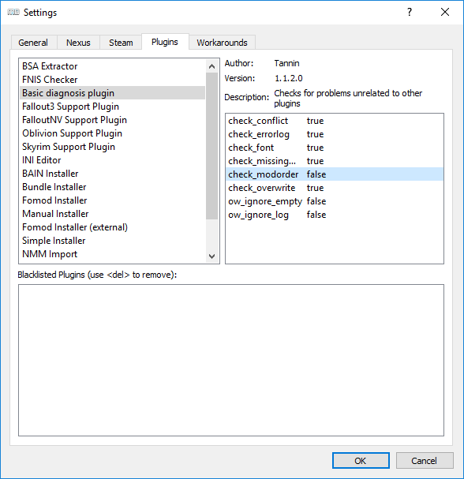

# Гайд по установке

## Содержание
+ [Скачивание/установка игры](#DownloadInstall)
+ [Дополнительные программы](#OblivionTools)
+ [Подготовка игры](#Preparation)
+ [Запуск игры](#StartGame)
+ [Установка необходимых модов](#MustHave)
+ [Полезные советы](#GoodTips)

##  Скачивание/установка игры

1) Для начала убедись, что вычистил все следы предыдущей установки (если она была). Проверь папки Стима или куда ты ещё устанавливал Обливион, проверь "Документы\My Games". Проверь установленные программы через Панель Управления или Reg Organizer или любую подобную софтину, вдруг он висит в списке.

2) Определись с языком игры. Если хочешь играть на русском, то тебе понадобится Золотое Издание от 1С. Любители английского могут взять игру как в [Стиме](http://store.steampowered.com/app/22330/The_Elder_Scrolls_IV_Oblivion_Game_of_the_Year_Edition/) (**внимание: нужна версия Game of the Year Edition Deluxe, она содержит все DLC, в Game of the Year Edition есть лишь KotN и SI**), так и в [GOG'е](https://www.gog.com/game/elder_scrolls_iv_oblivion_game_of_the_year_edition_deluxe_the).

3) Установка должна проводиться не на диск C. Нужен какой-нибудь D, E или где ты там держишь игрушки. Если ставишь пиратку, подойдёт "E:\Games", если из Стима - "E:\Steam Library". Поверь, это не спроста, на диске C (особенно в Program Files) часто возникают проблемы с правами записи. Данный гайд расскажет про установку стимовской версии (не пугайся, установки других версий и накатывание локализации будут рассмотрены).

##  Дополнительные программы

1) В данном гайде приводятся ссылки на все нужные программы - не скачивай их из других источников, особенно с русскоязычных сайтов - тамошние васяны любят настраивать софт, а сюрпризы тебе не нужны.

2) Этот софт можно спокойно качать, пока игра устанавливается, только не запускай. Можешь скачать Portable-версии, которые легче запихнуть в любую папку. Так и сделай: создай папку "E:\Games\Oblivion Tools", куда будешь кидать всё для работы с игрой. Если у тебя есть Скайрим, собранный по [данному руководству](https://github.com/VictorDragonslayer/SkyrimHead/blob/master/00_Вступление_и_шапка.md), то снова ставить данные программы тебе не потребуется - об этом далее.

3) Собственно, необходимые программы.
    + **Mod Organizer** (MO). Это менеджер модов, который является лучшим решением для допиливания игры. Отличается отлично сделанной виртуализацией, которая позволяет устанавливать моды в отдельные папки, а значит и удалять их без следов. Спасает в случае возникновения проблем в игре, предоставляя возможность отключить проблемный мод без необходимости переустановки всех остальных модов, а то и игры. [Ссылка на скачивание (Nexus)](https://www.nexusmods.com/skyrimspecialedition/mods/6194/?).
    
    *Если у тебя уже есть Скайрим, собранный на МО, то для сборки Обливиона тебе нужно будет снова поставить МО (в папку \Oblivion Tools\Mod Organizer).*
    
    + **LOOT**. Это сортировщик плагинов и не только. Может указать тебе на плагины, в которых есть ошибки - так называемые "грязные записи". [Ссылка на скачивание (Github)](https://github.com/loot/loot/releases/latest) - выбирай не Installer.
    
    *Если LOOT уже установлен, то МО подхватит его. При запуске LOOT'а просто выбери "TES IV: OBLIVION" в выпадающем списке.*
    
    + **TES5Edit**. Это программа для простого редактирования плагинов и относительно автоматической очистки их от "грязных записей", которые вам покажет LOOT. [Ссылка на скачивание (Nexus)](http://www.nexusmods.com/skyrim/mods/25859/?).
    
    *Если TES5Edit уже установлен, то достаточно добавить его в список исполняемых. Для этого в поле "Binary" укажи путь к исполняемому файлу (т.е. к TES5Edit.exe), в "Start in" - путь к игре (для стимовской версии - `D:\SteamLibrary\steamapps\common\Oblivion`), а в "Arguments" - `-tes4 -edit`.*
    
    + **Wrye Bash** (WB). Ещё один менеджер модов, который может пригодиться тебе не для управления модами, а для создания Башед-патча. Эта штука делает несколько полезных вещей, в том числе объединяет уровневые листы разных плагинов. [Ссылка на скачивание (Nexus)](http://www.nexusmods.com/skyrim/mods/1840/?) - выбирай не Installer.
    
    *Если Wrye Bash уже установлен, то достаточно добавить его в список исполняемых. Для этого в поле "Binary" укажи путь к исполняемому файлу (т.е. к Wrye Bash.exe), в "Arguments" укажи путь к игре через аргумент "-o" (`-o D:\SteamLibrary\steamapps\common\Oblivion\` для стимовской версии).*
    
    + **BethINI**. Автоматический настройщик ини-файлов для игры, имеет свои собственные оптимизированнные пресеты, также в нем удобно управлять некоторыми настройками. [Ссылка на скачивание (Nexus)](https://www.nexusmods.com/skyrim/mods/69787/?tab=files).
    
    *Эту программу НЕ нужно запускать через MO, не добавляй её в MO, закрывай MO перед её использованием.*

    + **Oblivion Mod Manager** (OBMM). Еще один менеджер модов, нужен чтобы устанавливать моды, запакованные в ".omod". [Ссылка на скачивание (Nexus)](https://www.nexusmods.com/oblivion/mods/2097/?tab=files) - выбирай не Installer.
    
    *Для установки этой программы просто скопируй содержимое архива в папку с игрой (`D:\SteamLibrary\steamapps\common\Oblivion` для стимовской версии). После этого MO должен сам увидеть obmm.*

4) Эти программы (кроме OBMM) должны лежать по своим папкам в "E:\Games\Oblivion Tools". Типа "E:\Games\Oblivion Tools\LOOT" и т.д. И пока Обливион у тебя не установлен, не запускай их.

5) Mod Organizer - программа особенная, использует для работы довольно спорный метод - перехват запросов системы. Из-за этого некоторые антивирусы могут мешать работе если не самого МО, то некоторых приложений, запущенных из него. Добавь всю папку МО в список исключений своего антивируса. Если хочешь - сделай то же самое с папкой игры. Проверь также, чтобы у них обеих не стояла галка "Только чтение" (такого быть не должно, но вдруг).

**Внимание**: следование этому гайду не освобождает от необходимости изучения инструкций к программам.

##  Подготовка игры

1) Пропатчи исполняемые файлы игры (Oblivion.exe и OblivionLauncher.exe) для использования 4 Гб RAM. Патчер скачай [отсюда](http://www.ntcore.com/4gb_patch.php). Если у тебя GOG'овская версия, то она уже пропатчена.

2) Запусти Лаунчер игры. Дождись, пока он определит настройки графики для твоего ПК, а затем выйди из него без каких-либо других действий.

3) Теперь по адресу "Документы\My Games" должна оказаться папка Oblivion, а в ней - Oblivion.ini. Если он есть, то пока что всё идёт нормально.

4) Теперь запусти Mod Organizer, обязательно от имени администратора. Выбери игру Oblivion и укажи ассоциировать nxm-ссылки Нексуса с МО. Далее тебе будет нужно пройти небольшую обучалку. Пройди её, она очень важна! И по возможности запомни: МО - это мощный инструмент, который требует некоторых навыков в обращении с ним, при этом обмазывание Обливиона имеет свои нюансы и сложности.

5) Открой окно управления профилями (левый верхний угол, третья кнопка слева) и скопируй профиль Default, назови новый Main или как-нибудь похоже, выставив при этом Automatic Archive Invalidation. По желанию можешь поставить галку Local Savegames.

6) Теперь закрой MO и открой BethINI. Во вкладке "setup" проверь, правильно ли указаны пути к игре и MO, а в строке "INI Path" выбери профиль MO, созданный в предыдущем пункте, после этого программа перезапустится. Во вкладке "Basic" выбери разрешение своего экрана и нужный пресет графики (должны быть выбраны "BethINI Presets"), отметь галочкой "Recommended Tweaks", по желанию можешь включить Vsync. Если понимаешь, что делаешь, то можешь донастроить инишник в остальных вкладках, после этого нажми "Save and Exit", можно возвращаться к MO.

7) Сейчас тебе надо добавить используемые тобой программы в список МО. Это нужно для того, чтобы они могли видеть моды, установленные через него. Нажми на 2 шестерёнки слева вверху и добавь перечисленные выше программы.

    > Вообще, все программы, которые обращаются к модам в процессе работы, должны запускаться через МО. И небольшой совет на будущее: если тебе нужно добавить в МО программу, которая была установлена через него, проще это сделать через вкладку Data прямо в МО.

8) Тебе потребуется [OBSE - Oblivion Script Extender](http://obse.silverlock.org), программа, на которой завязано множество модов.
    + Воспользуйся [гайдом по установке OBSE для МО 2.1.7+](https://github.com/ModOrganizer2/modorganizer/wiki/Running-Oblivion-OBSE-with-MO2).

##  Запуск игры

1) Если ты создал ярлык из предыдущего пункта, запускай игру только через него. Если нет, то через МО и только Oblivion OBSE.

2) Установи через МО [OBSE Tester](https://www.nexusmods.com/oblivion/mods/33574/?). В случае положительного результата переходи к установке необходимых модов, а OBSE Tester отключи.

##  Установка необходимых модов

> Почти все моды ты будешь ставить с Нексуса. Это делается очень просто: заходишь на страницу мода, читаешь описание, понравилось - переходишь во вкладку "Files" и нажимаешь "mod manager download". Загруженный мод появится в МО во вкладке "Downloads". Если же ты ставишь моды с других сайтов, то воспользуйся кнопкой установки из архива.

1) [Unofficial Oblivion Patch](http://www.nexusmods.com/oblivion/mods/5296/?) - багфиксы для основной игры. Играть без них - быть самому себе злобным Буратино.

2) [Unofficial Shivering Isles Patch](http://www.nexusmods.com/oblivion/mods/10739/?) - багфиксы для Дрожащих Островов.

3) [Unofficial Oblivion DLC Patches](https://www.nexusmods.com/oblivion/mods/9969/?) - багфиксы для остальных DLC.

4) [Oblivion Stutter Remover](http://www.nexusmods.com/oblivion/mods/23208/?) - фиксит проблемы с памятью. В его ini-файле выстави следующее: `bReplaceHeap = 1`, `iHeapAlgorithm = 6` (не пойдёт нормально - измени на 5), `iHeapSize = 700` (число - в диапазоне от 500 до 900). Если возникнут сложности с настройкой или артефакты, скачай инишник [отсюда](https://www.nexusmods.com/oblivion/mods/48959).

5) [EngineBugFixes](https://www.nexusmods.com/oblivion/mods/47085/?) - исправляет множество проблем движка.

    > **Важно:** МО имеет сложности при работе с модами, завязанными на OBSE, - если мод содержит dll, то МО её не подхватит. Как понять, содержит ли мод dll? В его архиве в папке \Data есть папка \OBSE, в которой упомянутые файлы обычно и лежат. Как решить эту проблему? Перекинь эти dll с сохранением пути в физическую папку \Data. Пример: UOP содержит `\OBSE\Plugins\obse_training_fix.dll` и `\OBSE\Plugins\obse_jail_fix.dll`; эти файлы должны быть скопированы так, чтобы их пути были `\SteamLibrary\steamapps\common\Oblivion\Data\OBSE\Plugins\obse_training_fix.dll` и `\SteamLibrary\steamapps\common\Oblivion\Data\OBSE\Plugins\obse_jail_fix.dll`.

**[Начиная с MO 2.1.7, сложностей с OBSE стало меньше.](https://github.com/ModOrganizer2/modorganizer/wiki/Running-Oblivion-OBSE-with-MO2)**

##  Полезные советы

1) Когда у тебя будет достаточно модов, МО может начать ругаться на неправильный их порядок в **ЛЕВОМ** списке. Он предложит тебе пофиксить это, но ты не должен соглашаться, лучше просто отключи это назойливое напоминание.
    

2) Иногда моды запакованы в файл с расширение ".omod", такие моды нужно устанавливать через OBMM. Открой его через MO, нажми кнопку "load" и открой свой мод. После того, как он появится в списке выбери его и нажми "Activate". После того, как пройдешь через меню установки, закрой OBMM. Все файлы, которые были распакованы, упали в папку "Overwrite" внизу левой панели MO, нажми на неё пкм и выбери "Создать мод", введи его название, теперь готово.

------

|[*К оглавлению*](../Оглавление.md)|
|:---:|
